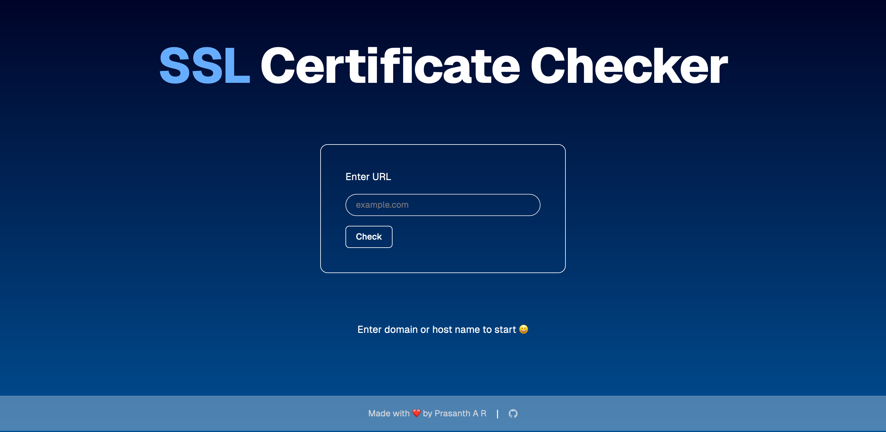
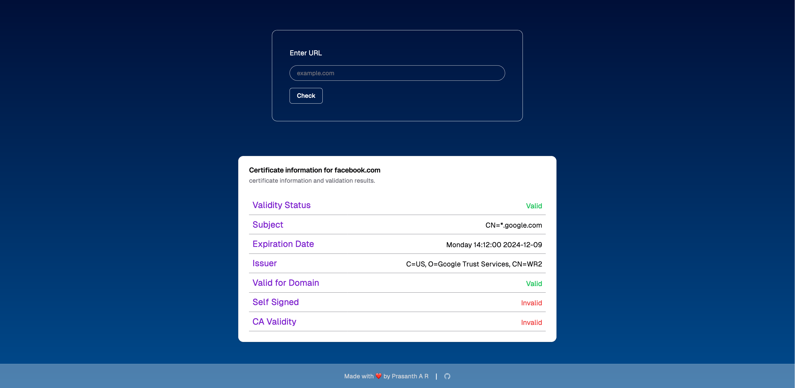

# SSL Certificate Checker

## Overview

This is a full-stack project using Nextjs as frontend  and built using Rust with the Actix-web framework, offering efficient, safe, and concurrent execution. The primary functionality involves fetching SSL certificates and extracting important certificate data such as issuer, subject, expiration date, and domain validation.

### Landing page

### Sample Result page


## Technology Choices
- **Next.js**: The frontend of the application is built using Next.js and provides a single-page application (SPA) with server-side rendering (SSR) capabilities. The user interface is designed to be intuitive and responsive, allowing users to easily interact with the application.

- **Rust**: Rust was chosen for its strong memory safety guarantees and performance benefits. Rust’s type system and ownership model eliminate many common bugs (e.g., null pointer dereferencing, data races), which makes it a great choice for building reliable and high-performance network services like SSL certificate checkers.
  


### Key Libraries(frontend):

### Key Libraries(backend):
- **Actix-Web**: Chosen for its high-performance, non-blocking capabilities in building Rust web applications.
- **Rustls & Webpki**: These libraries are used for managing SSL/TLS connections securely and validating certificate chains.
- **X509-parser**: This helps in parsing and extracting information from X.509 certificates.

## Assumptions and Design Decisions

1. **Domain Validation**: The application assumes that users will input domain names in various formats (with or without 'https://', 'www', etc.). The frontend includes logic to clean and validate these inputs.
2. **Revocation Status**: The revocation check (e.g., OCSP or CRL) is not yet implemented. It is assumed that most users are interested in the certificate validity period and domain verification.
3. **Error Handling**: Limited error handling has been implemented for cases such as invalid domain names or failed TLS connections. More detailed error responses could be provided.
4. **UI Design**: A clean, responsive design was chosen to ensure good user experience across different devices. 


## Known Limitations and Areas for Improvement

- **Domain Validation**: While the code checks for domain validity using the Subject Alternative Name (SAN) extension, there are edge cases with wildcards and IP addresses that aren't fully handled.
- **Reovcation Status**: need to implement to track invalid certificates and monitor certificate revocation occurrences.
- **Rate Limiting**: A rate limiting mechanism is implemented to avoid abuse of the SSL checker API. This ensures that clients are restricted to a set number of requests per minute or hour to protect the server from being overwhelmed.
- **View Past Certificate Checks** Add user authentication for tracking personal SSL certificate checks.
- **Client-Side Hydration** Due to Nextjs's server-side rendering capabilities, when ever the previous request failed then the next request doesn't hydrate to client-side and requires couple of refresh to hydrate the client component

## Installation and Setup

### Prerequisites:
- **Node.js** (for the frontend).
- **Rust** (for the backend).

### Steps:
1. **Clone the repository**:
   ```bash
   git clone https://github.com/0xprasanth/ssl-checker.git
   cd ssl-checker
   ```

2. **Install frontend dependencies**:
   ```bash
   cd frontend
   npm install
   ```
3. **Setup Environmental variables**:
    
    Refer `.env.example` for more info

    create `.env` file and add the following
   ```
   NEXT_PUBLIC_BACKEND_API=
   NEXT_BACKEND_API=
   ```

4. **Run the frontend**:
   ```bash
   npm run dev
   ```

5. **Install backend dependencies**:
   ```bash
   cd backend
   cargo build
   ```

6. **Run the backend**:
   ```bash
   cargo run
   ```

## Usage

1. Open the application in your browser (by default, at `http://localhost:3000`).
2. Enter a domain name into the input field.
3. Click the **Submit** button to initiate the SSL certificate check.
4. View the results section for details on the SSL certificate validation.

## Key Technologies

- **Frontend**: Next.js, Tailwind CSS for styling.
- **Backend**: Rust, HTTPS libraries for certificate validation.


